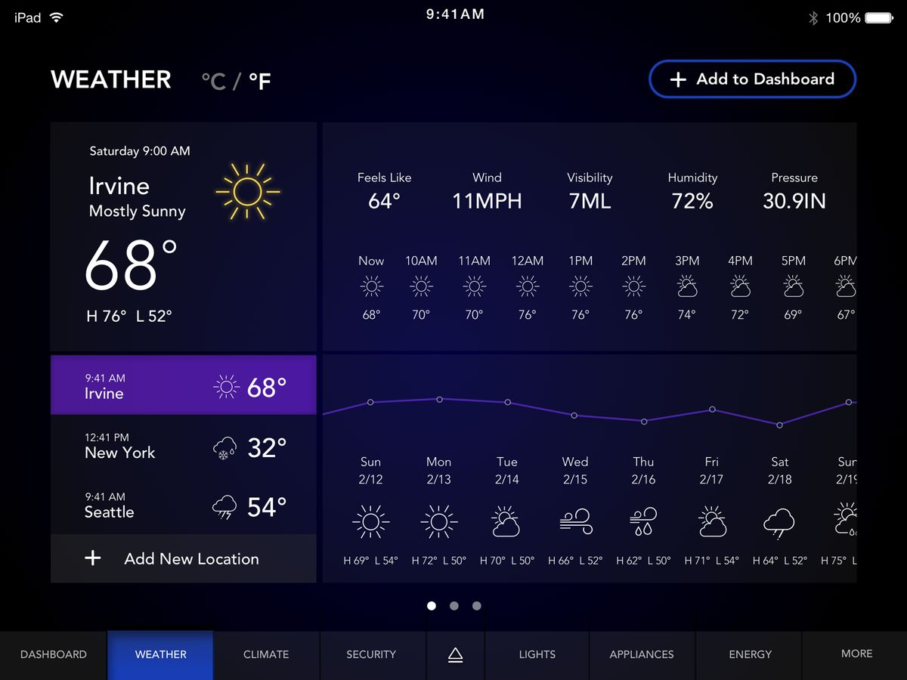

## Meteo — Design System (source of truth)

This repository contains a Vue + Vite app. This `README.md` is the **design system** we follow.

The goal: keep UI consistent (colors, typography, spacing, layout, and interaction states) across all views and components.

## Documentation map

- Design system (front-end visual source of truth): `README.md`
- Coding guide and project rules: `guideCode.md`

---

## Theme preview

The reference visual theme lives here:



Use the theme image when making UI decisions. If a component conflicts with this theme, update the component (or update this document + tokens first).

---

## Where styles live (CSS architecture)

- Global entry: `src/assets/main.css`
  - Imports: `src/assets/base.css`
- Global tokens (CSS variables): `src/assets/base.css` under `:root`

Rule: **Prefer CSS variables** (tokens) over hard-coded colors/sizes inside components.

---

## Design tokens

### Color primitives (`--vt-*`)

Defined in `src/assets/base.css`.

These are *raw palette values*. They should rarely be referenced directly in components.

| Token | Value | Usage |
|------|-------|-------|
| `--vt-c-white` | `#ffffff` | Base light surface |
| `--vt-c-white-soft` | `#f8f8f8` | Subtle surface |
| `--vt-c-white-mute` | `#f2f2f2` | Muted surface |
| `--vt-c-black` | `#181818` | Base dark surface |
| `--vt-c-black-soft` | `#222222` | Subtle dark surface |
| `--vt-c-black-mute` | `#282828` | Muted dark surface |
| `--vt-c-indigo` | `#2c3e50` | Primary text hue (light mode) |

Divider / border primitives:

| Token | Value |
|------|-------|
| `--vt-c-divider-light-1` | `rgba(60, 60, 60, 0.29)` |
| `--vt-c-divider-light-2` | `rgba(60, 60, 60, 0.12)` |
| `--vt-c-divider-dark-1` | `rgba(84, 84, 84, 0.65)` |
| `--vt-c-divider-dark-2` | `rgba(84, 84, 84, 0.48)` |

Text primitives:

| Token | Value |
|------|-------|
| `--vt-c-text-light-1` | `var(--vt-c-indigo)` |
| `--vt-c-text-light-2` | `rgba(60, 60, 60, 0.66)` |
| `--vt-c-text-dark-1` | `var(--vt-c-white)` |
| `--vt-c-text-dark-2` | `rgba(235, 235, 235, 0.64)` |

### Semantic tokens (`--color-*`)

These are the tokens you should use in the UI. They switch automatically for dark mode (see `prefers-color-scheme: dark`).

| Token | Light mode | Dark mode | Use for |
|------|------------|-----------|---------|
| `--color-background` | `--vt-c-white` | `--vt-c-black` | App background |
| `--color-background-soft` | `--vt-c-white-soft` | `--vt-c-black-soft` | Cards / soft panels |
| `--color-background-mute` | `--vt-c-white-mute` | `--vt-c-black-mute` | Muted panels |
| `--color-border` | `--vt-c-divider-light-2` | `--vt-c-divider-dark-2` | Default borders / dividers |
| `--color-border-hover` | `--vt-c-divider-light-1` | `--vt-c-divider-dark-1` | Hover borders |
| `--color-heading` | `--vt-c-text-light-1` | `--vt-c-text-dark-1` | Headings |
| `--color-text` | `--vt-c-text-light-1` | `--vt-c-text-dark-2` | Body text |

### Accent color (links)

In `src/assets/main.css`, anchors use a hard-coded accent:

- Default: `hsla(160, 100%, 37%, 1)`
- Hover background: `hsla(160, 100%, 37%, 0.2)`

Guideline:

- For text links, use the existing anchor styling.
- For new button/UI accents, **do not invent new greens**. Either reuse the link accent (for now) or promote it to a token later.

### Spacing tokens

| Token | Value | Use for |
|------|-------|---------|
| `--section-gap` | `160px` | Large section spacing (desktop layouts) |

---

## Typography

Global typography is defined in `src/assets/base.css`:

- Font stack: `Inter, -apple-system, BlinkMacSystemFont, 'Segoe UI', Roboto, ...`
- Base size: `15px`
- Line height: `1.6`

Guidelines:

1. Use semantic HTML (`h1`…`h6`, `p`, `small`) first.
2. Heading color should use `var(--color-heading)`.
3. Body text should use `var(--color-text)`.
4. Avoid hard-coding font families inside components.

---

## Layout & responsiveness

From `src/assets/main.css`:

- `#app` max width: `1280px`
- Default page padding: `2rem`
- Desktop (`min-width: 1024px`):
  - `body` becomes a centered flex container.
  - `#app` becomes a 2-column grid (`grid-template-columns: 1fr 1fr`).

Guidelines:

- Prefer building layouts that work in a single column first.
- At ≥1024px, consider whether content should follow the two-column grid pattern.

---

## Components: baseline rules

Until dedicated UI components exist, follow these rules when creating new UI:

### Surfaces (cards / panels)

- Background: `var(--color-background-soft)`
- Border: `1px solid var(--color-border)`
- Hover border (optional): `var(--color-border-hover)`

### Icons

- Icons should use `currentColor` so they inherit text color.
- Icon containers should sit on `var(--color-background)` when floating over lines/borders.

### Links

- Links use the existing global anchor style.
- Hover background is a subtle tint, not an underline.

---

## Dark mode

Dark mode is currently driven by `@media (prefers-color-scheme: dark)` in `src/assets/base.css`.

Rules:

- Do not hard-code light-only colors.
- Always verify contrast in both light and dark themes.

---

## Accessibility & interaction

Minimum expectations:

- Maintain readable contrast between `--color-text` and `--color-background`.
- Keep hover/active states visible.
- Don’t remove focus outlines without replacing them with an accessible focus style.

---

## Project scripts

### Setup

```sh
npm install
```

### Run (development)

```sh
npm run dev
```

### Build (production)

```sh
npm run build
```

### Preview production build

```sh
npm run preview
```

### Format

```sh
npm run format
```

---

## Contribution checklist (UI changes)

- [ ] Checked the change against `src/assets/theme.png`
- [ ] Used semantic tokens (`--color-*`) instead of raw values
- [ ] Verified light + dark mode
- [ ] Verified desktop breakpoint (≥1024px)


